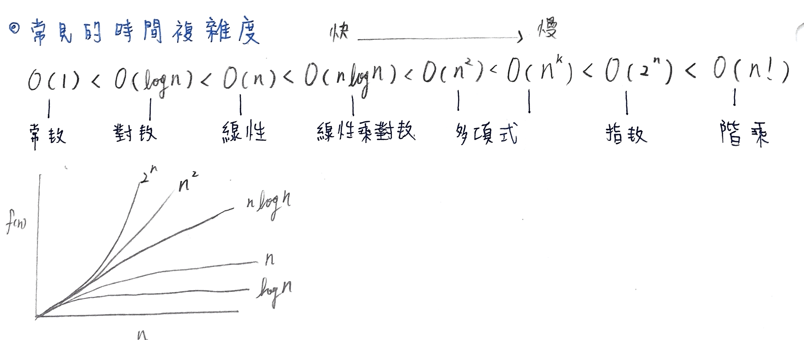

# 第一章-介紹演算法的設計與分析
對 Order 概念直觀與正規的介紹

## 分析解決問題的技巧
1. 線性搜尋(Sequential Search) 

    worst case : n

2. 二元搜尋(Binary Search)

    worst case : log2n+1

3. 費氏數列(Fibonacci)

  - 遞迴: 
  
    worst case : 2n/2

  - 迴圈(迭代): 
  
    worst case : n+1

## 時間複雜度分析
針對特定演算法，精確計量時間複雜度和空間複雜度。

- 大寫的英文字母 O 函數，代表演算法執行步驟數目上限
- 大寫的希臘字母 Ω 函數，代表下限
- 大寫的希臘字母 Θ 函數，代表同時滿足上限與下限（介於中間）
> 小結: 最佳、平均、最壞 => Ω 、 Θ 、 O 

時間複雜度往往無法正確反映演算法的快慢。例如 n=100 的情況下，有可能 O(n³) 的演算法表現的比 O(n²) 好。

ref: http://www.csie.ntnu.edu.tw/~u91029/AlgorithmAnalysis.html

