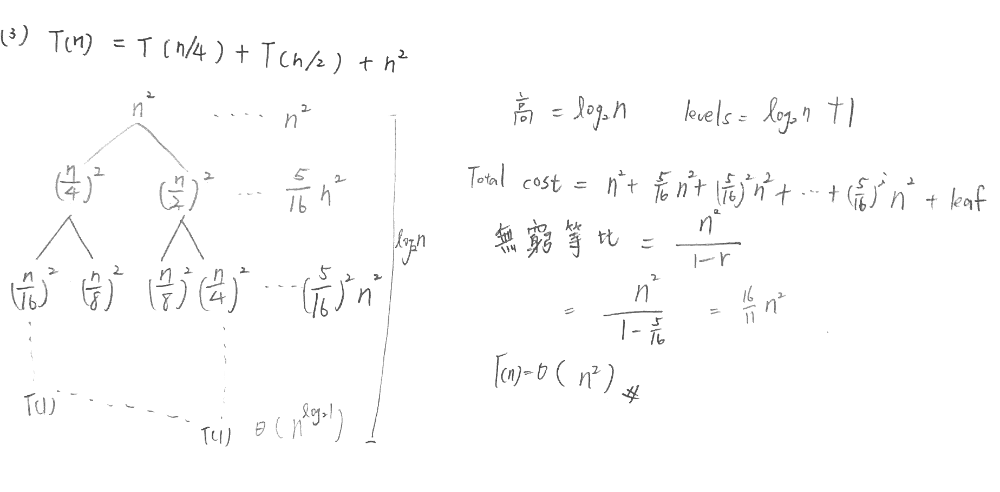

遞迴演算法則的複雜度分析
- 數學解法 (Mathematics-based method)
- 替代法 (Substitution method)
- 遞迴樹法 (Recursion tree method)
- 支配定理法 (Master theorem method)

一般來說，有兩種方式可以撰寫具有重覆執行 (Repetitive)特性的演算法
- Iteration (迴圈)
- Recursion (遞迴)

## 遞迴架構

```
Procedure 遞迴副程式名(參數)
{
  if (base case)
     return(結果); ……//達到終止條件時結束遞迴，需要時回傳結果
  else 
     general case; ……//利用general case執行遞迴呼叫，需要時加上return
}
```

> 遞迴比較沒有效率


## 舉例(費氏數列)
### Recursive Factorial Algorithm

```
inputs: num identified the ordinal of the Fibonacci number
outputs: returns the nth Fibonacci number
void Fib(int num)
{
     if (num is 0 OR num is 1)
         return num;
     else
         return (Fib(num-1) + Fib(num-2));
}
```

### Iterative Factorial Algorithm

```
inputs: n is the number being raised factorially
outputs: n! is returned
void Factorial(int n)
{
     factN = 1;
     for (i=1, i ≤ n, i++)
         factN = factN * i;
     return factN;
}
```


常用的數列總和複雜度一覽
- 等差數列： 1+2+3+…+n=O(n2)  
- 等比數列： r+r2…+rn=O(rn)
- 2次方數列：12+22+…+n2=O(n3)
- d次方數列：1d+2d+…+nd=O(nd+1)
http://mropengate.blogspot.com/2015/04/algorithm-ch1-master-theorem-super.html

## 遞迴樹與時間複雜度分析
遞迴的思想就是將大問題一層一層地分解為小問題來求解，如果我們把這個分解過程畫成圖，它其實就是一棵樹，我們稱之為遞迴樹。

以下是一些遞迴關係常用的解法。


### Recursion-tree method
1. 依照遞迴定義展開
2. 對每一層的cost加總，得到per-level cost 
3. 加總per-level cost，得到total cost




### Master Method
```
T(n) = aT(n/b) + f(n) ,  where a≥1, b> 1, and f is asymptotically positive. 
f (n) = O (nlogba–ε)for some constant ε> 0.
f (n) grows polynomially slower than nlogba (by nε factor)
Solution: T(n) = Θ(nlogba)
 
f (n) = Θ(nlogba lgkn)for some constant k≥0
f (n) and nlogba–ε grow at similar rates. 
Solution: T(n) = Θ(nlogba  lgk+1n).
T(n) = 3T(n / 3) + n log n , answer: T(n) = Θ(n log2n) 
  
f (n) grows polynomially faster than nlogba (by nε factor)
and f (n) satisfies regularity condition that af(n/b) ≤ cf(n) for some constant c< 1.
Solution: T(n) = Θ(f(n)).  
```
