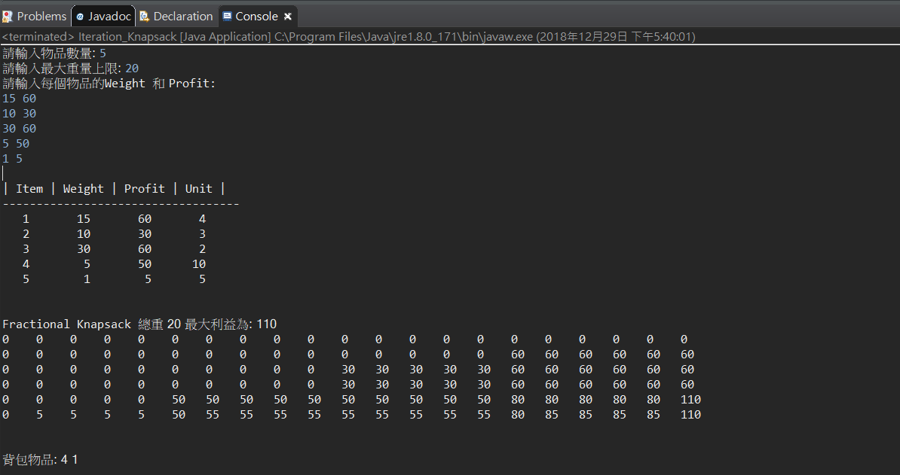

# 01-Knapsack Problem

## Recursive


```java
package dynamic;

import java.util.ArrayList;
import java.util.Scanner;


class Item{
	int item,value,weight,unit;
	public Item(int item,int weight,int value,int unit) {
		this.item=item;
		this.value=value;
		this.weight=weight;
		this.unit=unit;
	}
}
public class Recursive_Knapsack {
	static int  N=0,maxWeight=0;
	static ArrayList<Item> list;
	static int c[][];

	public static void main(String[] args) {
		Scanner scn = new Scanner(System.in);
		list = new ArrayList<>();
		System.out.print("請輸入物品數量: ");
		N = Integer.parseInt(scn.nextLine());
		System.out.print("請輸入最大重量上限: ");
		maxWeight = Integer.parseInt(scn.nextLine());
		int weight = 0, value = 0, unit = 0;
		c = new int[N + 1][maxWeight + 1];
		System.out.println("請輸入每個物品的Weight 和 Profit: ");
		list.add(new Item(0, 0, 0, 0));
		for (int i = 0; i < N; i++) {
			String arr[] = scn.nextLine().split(" ");
			weight = Integer.parseInt(arr[0]);
			value = Integer.parseInt(arr[1]);
			unit = Integer.parseInt(arr[1]) / Integer.parseInt(arr[0]);
			list.add(new Item(i + 1, weight, value, unit));
		}

		System.out.println("\n| Item | Weight | Profit | Unit |");
		System.out.println("-----------------------------------");
		for (int i = 1; i < N; i++) {
			System.out.printf("%4d %8d %8d %7d\n", list.get(i).item, list.get(i).weight, list.get(i).value,
					list.get(i).unit);
		}

		knapsack(N, maxWeight);
		System.out.printf("\n\nFractional Knapsack 總重 %d 最大利益為: %d\n", maxWeight, c[N][maxWeight]);
		// solution
		int res=c[N][maxWeight];
		for (int i = N; i > 0  &&  res > 0; i--) {
			  if (res != c[i-1][maxWeight]) {
			    //itemsSolution.add(items[i-1]);
			    // we remove items value and weight
				  System.out.print(list.get(i).item+" ");
			    res -= list.get(i).value;
			    maxWeight -= list.get(i).weight;
			  }
			}
	}

	static int knapsack(int i, int W) {
		if (i < 0) {
			return 0;
		}
		if (list.get(i).weight > W) {
			return knapsack(i - 1, W);
		} else {
			return c[i][W] = Math.max(knapsack(i - 1, W), knapsack(i - 1, W - list.get(i).weight) + list.get(i).value);
		}
	}

}
```

## Iteration 迭代
使用 for 迴圈實作。

```java
package dynamic;

import java.util.ArrayList;
import java.util.Scanner;

class Item {
	int item, value, weight, unit;

	public Item(int item, int weight, int value, int unit) {
		this.item = item;
		this.value = value;
		this.weight = weight;
		this.unit = unit;
	}
}

public class Iteration_Knapsack {

	static int N = 0, maxWeight = 0;
	static ArrayList<Item> list;
	static int c[][];

	public static void main(String[] args) {
		Scanner scn = new Scanner(System.in);
		list = new ArrayList<>();
		System.out.print("請輸入物品數量: ");
		N = Integer.parseInt(scn.nextLine());
		System.out.print("請輸入最大重量上限: ");
		maxWeight = Integer.parseInt(scn.nextLine());
		int weight = 0, value = 0, unit = 0;
		c = new int[N + 1][maxWeight + 1];
		System.out.println("請輸入每個物品的Weight 和 Value: ");
		// list.add(new Item(0, 0, 0, 0));
		for (int i = 0; i < N; i++) {
			String arr[] = scn.nextLine().split(" ");
			weight = Integer.parseInt(arr[0]);
			value = Integer.parseInt(arr[1]);
			unit = Integer.parseInt(arr[1]) / Integer.parseInt(arr[0]);
			list.add(new Item(i + 1, weight, value, unit));
		}
		// 動態規劃背包
		for (int i = 1; i <= N; i++) {
			// we iterate on each capacity
			for (int j = 0; j <= maxWeight; j++) {
				if (list.get(i - 1).weight > j)
					c[i][j] = c[i - 1][j];
				else
					// we maximize value at this rank in the matrix
					c[i][j] = Math.max(c[i - 1][j], c[i - 1][j - list.get(i - 1).weight] + list.get(i - 1).value);
			}
		}

		System.out.println("\n| Item | Weight | Value | Unit |");
		System.out.println("-----------------------------------");
		for (int i = 0; i < N; i++) {
			System.out.printf("%4d %8d %8d %7d\n", list.get(i).item, list.get(i).weight, list.get(i).value,
					list.get(i).unit);
		}
		System.out.printf("\n\nFractional Knapsack 總重 %d 最大利益為: %d\n", maxWeight, c[N][maxWeight]);

		// 列出陣列
		for (int i = 0; i <= N; i++) {
			for (int j = 0; j <= maxWeight; j++) {
				System.out.printf("%-5d", c[i][j]);
			}
			System.out.println();
		}
		// solution
		System.out.print("\n\n背包物品: ");
		int res = c[N][maxWeight];
		for (int i = N; i > 0 && res > 0; i--) {
			if (res != c[i - 1][maxWeight]) {
				// itemsSolution.add(items[i-1]);
				// we remove items value and weight
				System.out.print(list.get(i - 1).item + " ");
				res -= list.get(i - 1).value;
				maxWeight -= list.get(i - 1).weight;
			}
		}

	}

}
```

### 測試
- 範例1

```
測資:

5
20
15 60
10 30
30 60
5 50
1 5
```

```
驗證:
 weight: 5+15=20
 value: 50+60=110
```




ref: https://medium.com/@ssaurel/solving-the-knapsack-problem-in-java-c985c71a7e64
