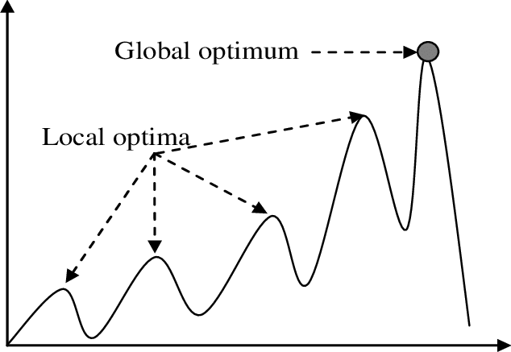

# Genetic Algorithm

模仿達爾文的演化論，兩性生殖的優點是生出來的子代和父代差異是很大的，下一代的 DNA 是由父母較配後的結果，GA 適用於兩個好的父母會生出好的子女之問題上，也就是說好的父代和母代交配出來之後產生出好的下一代這種特性才能用遺傳演算法。

## 名詞解釋
使用基因演算法需要暸解以下名詞：

1. 種群 (Population)

    你可以想像成一個區域內的所有個體，數個個體集合起來就是種群
2. 染色體 (Chromosome)

    一個種群內有很多個體，在每個個體中有獨一無二的染色體
3. 基因 (Gene)

    每個染色體內的最小單位，不同的基因組合形成一個新的染色個體
4. 交配遺傳(Crossover)

    新的個體會遺傳父母雙方各一部分的基因，至於怎麼遺傳就是看你的 `Crossover` 方法。
5. 突變(Mutation)

    在遺傳交配的過程中同時有一定的概率發生基因突變，突變的用意很簡單，若一個種群中找到一個解但這個解只是區域最佳解(Local Optimum)話再怎麼交配最後跑出來的值可能還是區域最佳解，此時若在交配過程中有一定的機率突變可能因此跨過障礙找到一個最佳的全域最佳解(Global Optimum)。

    

結論是基因演算法在繁殖過程中會發生基因交叉(Crossover) ，基因突變 (Mutation)。每一次繁殖會計算適應度(Fitness)，適應度低的個體會被逐步淘汰，而適應度高的個體會越來越多。那麼經過 N 代的自然選擇後，儲存下來的個體都是適應度很高的，其中很可能包含最佳解的個體。
