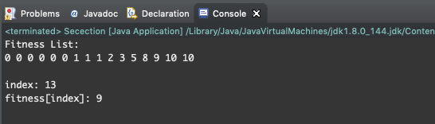
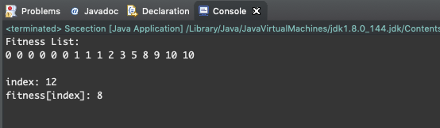

# Genetic Algorithm

模仿達爾文的演化論，兩性生殖的優點是生出來的子代和父代差異是很大的，下一代的 DNA 是由父母較配後的結果，GA 適用於兩個好的父母會生出好的子女之問題上，也就是說好的父代和母代交配出來之後產生出好的下一代這種特性才能用遺傳演算法。


## 名詞解釋
使用基因演算法需要暸解以下名詞：

1. 種群 (Population)

    你可以想像成一個區域內的所有個體，數個個體集合起來就是種群
2. 染色體 (Chromosome)

    一個種群內有很多個體，在每個個體中有獨一無二的染色體
3. 基因 (Gene)

    每個染色體內的最小單位，不同的基因組合形成一個新的染色個體
4. 交配遺傳(Crossover)

    新的個體會遺傳父母雙方各一部分的基因，至於怎麼遺傳就是看你的 `Crossover` 方法。
5. 突變(Mutation)

    在遺傳交配的過程中同時有一定的概率發生基因突變，突變的用意很簡單，若一個種群中找到一個解但這個解只是區域最佳解(Local Optima)話再怎麼交配最後跑出來的值可能還是區域最佳解，此時若在交配過程中有一定的機率突變可能因此跨過障礙找到一個最佳的全域最佳解(Global Optimum)。

    

> 遺傳運算元：遺傳演算法有3個最基本的操作=> 選擇，交叉，變異。

## 架構與步驟
基因算法基本步驟是：

1 ) 初始化    
  - t = 0 進化代數計數器
  - T 是最大進化代數
  - 隨機生成 M 個個體作為初始群體 P(t)

2 ）個體評價計算 P(t) 中各個個體的適應度值
  - Fitness

3 ）選擇運算將選擇算子作用於群體
  - Selection (輪盤選擇法)

4 ）交叉運算將交叉算子作用於群體
  - Crossover
  - 變異運算將變異算子作用於群體，並通過以上運算得到下一代群體 P(t+1)

5 ）一定的機率突變
  - Mutate
  - 交叉運算後隨機機率挑選其中一個位元0變1或1變0

6 ）終止條件判斷   t ≦ T , t =  t+1  回到步驟2
  - 當 t>T 時終止輸出解。 


結論是基因演算法在繁殖過程中會發生基因交叉(Crossover) ，基因突變 (Mutation)。每一次繁殖會計算適應度(Fitness)，適應度低的個體會被逐步淘汰，而適應度高的個體會越來越多。那麼經過 N 代的自然選擇後，儲存下來的個體都是適應度很高的，其中很可能包含最佳解的個體。

### 初始化
需要將問題的解編碼成字串的形式才能使用遺傳演算法。最簡單的一種編碼方式是二進位制編碼，即將問題的解編碼成二進位制位陣列的形式。例如，問題的解是整數，那麼可以將其編碼成二進位制位陣列的形式。這邊舉個例子，將 0-1 字串作為0-1背包問題的解就屬於二進位制編碼。

```
ex:
    基因A：10101010101010 (代表一個個體的染色體)
```

### 適應度 (Fitness)
適應度是用於評價某個染色體的價值。在我們每次繁殖過程中要計算每個基因的適應值，適應值越接近目標值越好代表接近最佳解。例如：0-1背包問題的目標值是在限定總重量(W)中所取得物品的價值(value)。

### 選擇 (Selection)
選擇一些染色體來產生下一代。一種常用的選擇策略是 `比例選擇`，也就是個體被選中的概率與其適應度函式值成正比。假設群體的個體總數是M，那麼那麼一個體Xi被選中的概率為f(Xi)/( f(X1) f(X2) …….. f(Xn) ) 。比例選擇實現演算法就是所謂的 `輪盤選擇法` (Roulette Wheel Selection)。

所謂的輪盤選擇法就是在整個族群中，每個個體存活下來或是可以產生後代的機率和個體的評估分數成正比。也就是說，越有優勢(Fintness越大)的個體存活下來(Selection被選擇到)的機率越大，但弱勢個體也有存活的可能，不是絕對的淘汰。就想像個體放在飛標靶上，而個體分數就對應到個體擁有的標靶面積。

#### 方法一
此方法使用 Fitness 下去做 Selection 挑選的依據。使用者可以手動的先把 `fitness[]` 陣列放入數值，切記要從小到到排序才符合輪盤選擇規則，首先計算所有的 Fitness 總和存入 `totalSum` 變數中;接著0~totalSum 中隨機取得亂數存入 `randNum`;最後從陣列最尾依序相加並存入 `partialSum`;當 `partialSum` 大於等於隨機取得的亂數 `randNum` 就停止並回傳目前的 index，表示這一次輪盤所挑選的內容。

```java
public class Secection {
	static int fitness[]={0,0,0,0,0,0,1,1,1,2,3,5,8,9,10,10};
	public static void main(String[] args) {
		System.out.println("Fitness List:");
		for(int i=0;i<fitness.length;i++)
			System.out.print(fitness[i]+" ");
		int index=selection(); // 輪盤法挑選一個 index
		System.out.println("\n\nindex: "+index+"\nfitness[index]: "+fitness[index]);
	}
	public static int selection() {
		int totalSum=0; // 全部 Fitness 總和的變數
		int randNum=0; // 0~totalSum 中隨機取得亂數的變數
		int partialSum=0; // Fitness陣列中從最尾巴開始加總的變數
		
		// 計算所有的 Fitness 總和
		for(int i=0;i<fitness.length;i++){
			totalSum+=fitness[i];
		}
		// 0~totalSum 中隨機取得亂數
		randNum=(int)(Math.random() *totalSum);
		
		// 從 N 開始遞減把每個 Fitness 相加若 partialSum 大於等於隨機取得的亂數(randNum)
		// 就把索引值回傳代表選擇到這一個
		for(int i=fitness.length-1;i>=0;i--) {
			partialSum+=fitness[i];
			if(partialSum>=randNum) {
				return i;
			}
		}
		return -1;
	}
}
```

##### 測試

```
參數設定:
  fitness[]={0,0,0,0,0,0,1,1,1,2,3,5,8,9,10,10};  

  ps:須由小到大排列
```



#### 方法二
此方法是利用 Fitness 算出總和再依據計算每一個的機率(probability)，首先計算所有 Fitness 將總和存入變數 `totalSum` 中。接著計算每個 Fitness 的機率並依序存入 `probability[]` 陣列中;機率的計算的方法是 `fitness[i]/totalSum`，分母為目前的 Fitness 值，分母為 Fitness 陣列中的總和。接著0~1 中隨機取得亂數(機率)並存到變數 `randNum` 中。最後迴圈從尾依序累加每一個 `probability[]` 陣列中的機率，當 `partialSum` 機率依據加總直到隨機挑選出來的 `randNum` 小於等於 `partialSum` 就把所索引值回傳代表選擇到這一個。

```java
public class Secection {
	static int fitness[]={0,0,0,0,0,0,1,1,1,2,3,5,8,9,10,10};
	static double probability[]=new double[fitness.length];
	public static void main(String[] args) {
		System.out.println("Fitness List:");
		for(int i=0;i<fitness.length;i++)
			System.out.print(fitness[i]+" ");
		int index=selection(); // 輪盤法挑選一個 index
		System.out.println("\n\nindex: "+index+"\nfitness[index]: "+fitness[index]);
	}
	public static int selection() {
		double totalSum=0; // 全部 Fitness 總和的變數
		double randNum=0; // 0~1 中隨機取得亂數的變數
		double partialSum=0; //目前機率加總的變數
		
		// 計算所有的 Fitness 總和
		for(int i=0;i<fitness.length;i++){
			totalSum+=fitness[i];
		}
		// 計算每個的機率
		for(int i=0;i<fitness.length;i++) {
			probability[i]=fitness[i]/totalSum;
		}
		// 0~1 中隨機取得亂數(機率)
		randNum=Math.random();
		
		// partialSum 機率依據加總直到隨機挑選出來的 randNum 小於等於 partialSum
		// 就把所索引值回傳代表選擇到這一個
		for(int i=probability.length-1;i>=0;i--) {
			partialSum+=probability[i];
			if(randNum<=partialSum)
				return i;
		}
		return -1;
	}
}
```

##### 測試

```
參數設定:
  fitness[]={0,0,0,0,0,0,1,1,1,2,3,5,8,9,10,10};  

  ps:須由小到大排列
```



## 交叉 (Crossover)
所謂交叉運算，是指對兩個相互配對的染色體依據交叉率按某種方法相互交換其部分基因，從而形成新的個體。交叉運算在GA中起關鍵作用，是產生新個體的主要方法。

Crossover 方法有很多種，以下分別介紹幾種常用的方法：

1 )  單交叉交換基因

可以從左右各切一刀然後交換中間的基因，至於兩刀如何切可以用亂數來實作。

```
交叉前：

10101|000000111111|10000

00101|111111000000|11100

交叉後：

10101|111111000000|10000

00101|000000111111|11100
```

2 ) 雙交叉交換基因

此方法也是左右各切一刀，然後互換左右的基因序列(保留中間部分)。

```
交叉前：

00|0010|11

10|0111|01

交叉後：

10|0010|01

00|0111|11
```

3 ) 位元AND運算

此方法透過 `&` 運算子來產生新的子代，簡單來說就是父母利用 AND 運算。

```
AND運算： 
0 AND 0         0 
0 AND 1         0 
1 AND 0         0 
1 AND 1         1 
```

```
交叉前：

101010

000111

交叉後：

000010

```

4 ) 位元OR運算

此方法透過 `|` 運算子來產生新的子代，簡單來說就是父母利用 OR 運算。

```
OR運算： 
0 OR 0          0 
0 OR 1          1 
1 OR 0          1 
1 OR 1          1 
```

```
交叉前：

101010

000111

交叉後：

101111

```

除了 AND 與 OR 運算，各位也可以試試 XOR 以及 NOT 運算

```
XOR運算： 
0 XOR 0         0 
0 XOR 1         1 
1 XOR 0         1 
1 XOR 1         0 

NOT運算： 
NOT 0           1 
NOT 1           0
```

## 突變 (Mutate)
在繁殖的過程中有一定的機率突變，突變的時間點在當父母繁殖交配後產生出來的新子代，此時新的子代經由突變率會有一定的機率突變。突變的方式有很多種下面簡單列出幾種。

1 ) 隨機挑選一個位元(基因)做NOT運算

簡單來說就是隨機挑選一位 1 變 0、0 變 1

```
* 假設隨機挑選到第一個位元

突變前：

10101011

突變後：

00101011

```

2 ) 隨機挑選兩個位元(基因)交換

就如標題，我們從一個染色體中隨機挑選兩個基因然後交換。

```
* 假設隨機挑選到第一和二個位元

突變前：

10101011

突變後：

01101011

```


## Reference
- [遺傳演算法GA(Genetic Algorithm)入門知識梳理](https://codertw.com/%E4%BA%BA%E5%B7%A5%E6%99%BA%E6%85%A7/4400/#outline__1)
- [Java Implementation of the Roulette Wheel Selection Method](https://www.youtube.com/watch?v=9JzFcGdpT8E)

