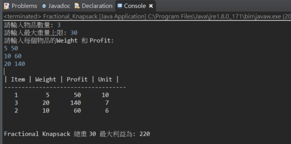
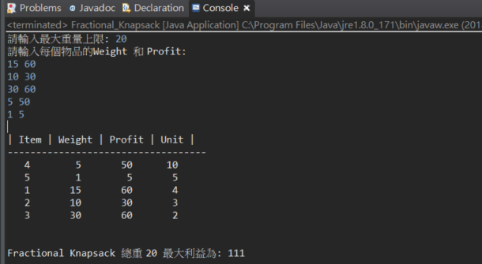

# Greedy

## Fractional Knapsack Problem
使用Greedy Algorithm
 
此問題是允許將物品做切割，因此我們可以直接很直觀的從單位價值最高的物品開始拿，直到背包負重的上限。
因此使用Greedy Algorithm處理Fractional Knapsack Problem所花費的時間在於計算出每一樣物品的單位價值，然後再將它們做由高到低的排列，再拿取就可以使達到我們要的目的。


```java
package Gredy;

import java.util.ArrayList;
import java.util.Scanner;

class Item{
	int item,profit,weight,unit;
	public Item(int item,int weight,int profit,int unit) {
		this.item=item;
		this.profit=profit;
		this.weight=weight;
		this.unit=unit;
	}
}
public class Fractional_Knapsack {
	
	static int  N=0,maxWeight=0;
	static ArrayList<Item> list;

	public static void main(String[] args) {
		Scanner scn = new Scanner(System.in);
		list = new ArrayList<>();
		System.out.print("請輸入物品數量: ");
		N = Integer.parseInt(scn.nextLine());
		System.out.print("請輸入最大重量上限: ");
		maxWeight=Integer.parseInt(scn.nextLine());
		int weight = 0, profit = 0, unit = 0;
		System.out.println("請輸入每個物品的Weight 和 Profit: ");
		for (int i = 0; i < N; i++) {
			String arr[] = scn.nextLine().split(" ");
			weight = Integer.parseInt(arr[0]);
			profit = Integer.parseInt(arr[1]);
			unit = Integer.parseInt(arr[1]) / Integer.parseInt(arr[0]);
			list.add(new Item(i + 1, weight, profit, unit));
		}

		sort(); // 以單位利益排序
		int maxProfit=0,nowWeight=0;
		for(int i=0;i<N;i++) {
			if(nowWeight+list.get(i).weight>maxWeight) {
				maxProfit+=(maxWeight-nowWeight)*list.get(i).unit; // Fractional
				nowWeight=maxWeight;
				break;
			}else {
				maxProfit+=list.get(i).profit;
				nowWeight+=list.get(i).weight;
			}
		}
		

		System.out.println("\n| Item | Weight | Profit | Unit |");
		System.out.println("-----------------------------------");
		for (int i = 0; i < N; i++) {
			System.out.printf("%4d %8d %8d %7d\n", list.get(i).item, list.get(i).weight, list.get(i).profit,
					list.get(i).unit);
		}
		
		System.out.printf("\n\nFractional Knapsack 總重 %d 最大利益為: %d\n",nowWeight,maxProfit);

	}

	// Bubble Sort
	public static void sort() {
		for (int i = 0; i < N - 1; i++) {
			for (int j = i + 1; j < N; j++) {
				if (list.get(i).unit < list.get(j).unit) {
					Item temp = list.get(i);
					list.set(i, list.get(j));
					list.set(j, temp);
				}
			}
		}
	}

}


/**
 * Test Data

3
30
5 50
10 60
20 140

5
20
15 60
10 30
30 60
5 50
1 5


 * */
```


## 測試
- 範例1

```
測資:

3
30
5 50
10 60
20 140
```

```
驗證:

(7*20)+(5*10)+(5*6)=220
```




- 範例2

```
測資:

5
20
15 60
10 30
30 60
5 50
1 5
```

```
驗證:

 (1*5)+(5*10)+(14*4)=111
```




ref:https://sls.weco.net/blog/jojen/25-dec-2006/8668
